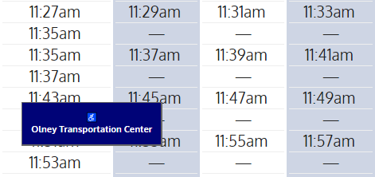
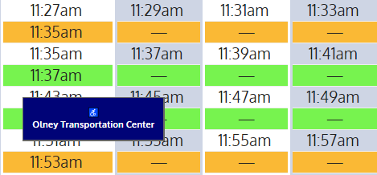

# SEPTA Broad Street Line (BSL) with color added

SEPTA's consolidated BSL schedule...great for planning downtown excursions...terrible for figuring out which row is the Express and which is the 8th&Market. For me.  If you know how...GREAT. Me?  Welcome to my first *something-I-want* Python project.
 
---
## Specifications

Tint rows on chart; use Septa BSL color scheme: Orange-Yellow=8th&Market, Green=Express. 

---
## Results
 
Septa Schedule - Before

Septa Schedule - After

---
## Discoveries During the Project
 
+ I never heard of regular expressions before doing this
    - You learn more/faster when learning in context with a specific goal.

---
## Status

Work In Progress.   Improvements ahead. 
 